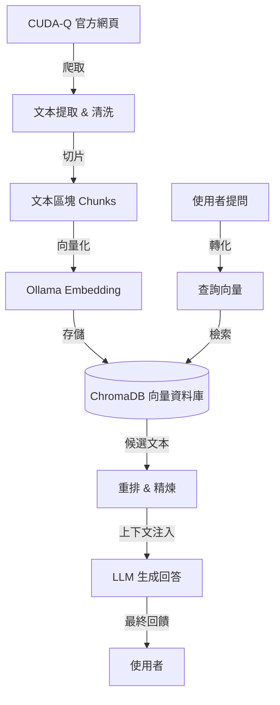

# CUDA-Q RAG 智能問答助理

[](https://www.python.org/)
[](https://pixi.sh/)
[](https://ollama.com/)

本專案利用 RAG (Retrieval-Augmented Generation) 技術，建構一個專注於 **NVIDIA CUDA-Q** 的本地端 AI 問答助手。系統整合了網頁爬蟲、文本切片、向量檢索與 LLM 回應，實現高效且精準的知識檢索。

---

## 系統架構 (System Architecture)

系統運作流程分為 **知識建置 (Indexing)** 與 **檢索生成 (RAG Flow)** 兩大核心階段：



### 階段一：建立知識庫 (Indexing Phase)
*   **資料收集 (Extraction)**: 自動抓取 [CUDA-Q v0.7.0](https://nvidia.github.io/cuda-quantum/0.7.0/) 網頁內容，並移除 Sphinx 生成的特殊符號 (如 `¶`)。
*   **文本切塊 (Chunking)**: 採用 `RecursiveCharacterTextSplitter`，區塊大小 1000 字符，重疊量 200 字符，確保代碼區塊完整性與語義連貫。
*   **神經索引 (Neural Indexing)**: 使用本地端 `qwen3-embedding:8b` 模型將提取內容轉換為高維語義向量。

### 階段二：檢索與生成 (Retrieval & Generation Phase)
*   **語義檢索 (Retrieval)**: 即時將問題轉化為向量，並於 **ChromaDB** 中進行優化的 Top-10 相似度檢索。
*   **專業回答 (Generation)**: 結合提示詞工程並注入檢索到的 Top-6 技術文件內容，引導 LLM (`qwen3:14b`) 進行精確解答。

---

## 環境安裝 (Installation Guide)

推薦使用 **[pixi](https://pixi.sh/)** 管理專案環境，以確保跨平台環境的一致性。

### 1. 安裝 Pixi (Package Manager)

根據您的作業系統，執行對應的安裝指令：

#### Linux / macOS
```bash
curl -fsSL https://pixi.sh/install.sh | sh
```
*若無 `curl`，可使用 `wget`:*
```bash
wget -qO- https://pixi.sh/install.sh | sh
```

#### Windows (PowerShell)
```powershell
powershell -ExecutionPolicy Bypass -c "irm -useb https://pixi.sh/install.ps1 | iex"
```

### 2. 初始化專案

#### 第一步：安裝 Python 套件 (軟體環境)
此步驟會安裝 `langchain-ollama` 等程式碼依附套件 (約數 MB)。
```bash
pixi install
```
*(非 Pixi 用戶可使用 `pip install -r requirements.txt`)*

#### 第二步：拉取 LLM 模型權重 (模型大腦)
確保 [Ollama](https://ollama.com/) 正在執行，並下載運行所需的模型權重 (約數 GB)。**這是 RAG 系統運行必經的步驟。**
```bash
# 此指令會自動執行 ollama pull 拉取 qwen3:14b 與 qwen3-embedding:8b
pixi run pull-model
```

---

## 執行指南 (Execution Workflow)

依序執行以下任務即可完成整個 RAG 流程。

### 第一步：抓取資料 (Crawl)
下載網頁文件並將其切分為 chunks，儲存於 `cuda_quantum_full_docs` 目錄中。
```bash
pixi run crawl
```
*(手動指令: `python cudaq_craw_and_Split.py`)*

### 第二步：建置索引 (Index)
將文本內容透過 Ollama 轉換為向量並存入 ChromaDB。
```bash
pixi run embed
```
*(手動指令: `python embedding.py`)*

### 第三步：啟動問答 (Query)
開啟互動式終端介面，您可以輸入問題來測試檢索結果與模型回應。
```bash
pixi run query
```
*(手動指令: `python query.py`)*

### Elasticsearch 版本 (Elasticsearch Version)
本專案現在支援使用 Elasticsearch 作為向量資料庫。

#### 1. 啟動 Elasticsearch
如果您本機尚未安裝 Elasticsearch，可以使用專案中的 `docker-compose.yml` 快速啟動：
```bash
docker-compose up -d
```

#### 2. 執行 Elasticsearch RAG
執行以下指令，系統會自動檢查索引是否存在，若不存在則會自動從 `cuda_quantum_full_docs/splits` 讀取資料並建立索引：
```bash
python query_es.py
```

---

## 專案目錄結構 (Project Structure)

```text
├── cudaq_craw_and_Split.py   # 網頁爬蟲與文檔切分邏輯
├── embedding.py              # 向量化算力與資料庫持久化 (ChromaDB)
├── query.py                  # RAG 檢索流程與互動式介面 (ChromaDB)
├── query_es.py               # Elasticsearch RAG 版本 (自動處理索引與查詢)
├── docker-compose.yml        # 用於啟動 Elasticsearch 的 Docker 配置
├── pixi.toml                # Pixi 專案配置與 Tasks 定義
├── requirements.txt         # 標準 Pip 相依列表
└── cuda_quantum_chroma_db/   # 本地向量存儲目錄 (自動生成)
```

