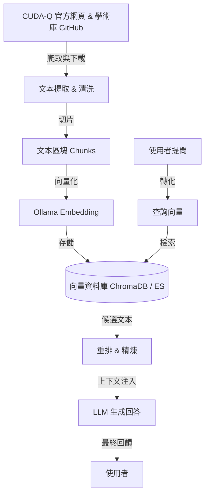

# CUDA-Q RAG 智能問答助理

[](https://www.python.org/)
[](https://pixi.sh/)
[](https://ollama.com/)

本專案利用 RAG (Retrieval-Augmented Generation) 技術，建構一個專注於 **NVIDIA CUDA-Q** 的本地端 AI 問答助手。系統整合了網頁爬蟲、文本切片、向量檢索與 LLM 回應，實現高效且精準的知識檢索。針對最新的版本，系統更全面整合了 NVIDIA 的官方教學倉庫 (`cuda-q-academic`)，並支援細緻的數學公式轉換效果！

---

## 系統架構 (System Architecture)

系統運作流程分為 **知識建置 (Indexing)** 與 **檢索生成 (RAG Flow)** 兩大核心階段：


```mermaid
graph TD
    A[CUDA-Q 官方網頁 & 學術庫 GitHub] -->|爬取與下載| B[文本提取 & 清洗]
    B -->|切片| C[文本區塊 Chunks]
    C -->|向量化| D[Ollama Embedding]
    D -->|存儲| E[(向量資料庫 ChromaDB / ES)]
    
    F[使用者提問] -->|轉化| G[查詢向量]
    G -->|檢索| E
    E -->|候選文本| H[重排 & 精煉]
    H -->|上下文注入| I[LLM 生成回答]
    I -->|最終回饋| J[使用者]
```

### 階段一：建立知識庫 (Indexing Phase)
*   **資料收集 (Extraction)**: 
    *   自動抓取 [CUDA-Q v0.7.0](https://nvidia.github.io/cuda-quantum/0.7.0/) 網頁內容，並移除 Sphinx 生成的特殊符號 (如 `¶`)。
    *   **全自動學術庫掛載**: 利用腳本從 GitHub 直接 `git clone` 或 `pull` [cuda-q-academic 教學資源庫](https://github.com/NVIDIA/cuda-q-academic)，並自動把所有的 Jupyter Notebook (`.ipynb`) 和 Markdown 筆記解析為純文本，豐富 RAG 的題庫！
*   **文本切塊 (Chunking)**: 採用 `RecursiveCharacterTextSplitter`，區塊大小 1000 字符，重疊量 200 字符，確保代碼區塊完整性與語義連貫。
*   **神經索引 (Neural Indexing)**: 使用本地端 `qwen3-embedding:8b` 模型將提取內容轉換為高維語義向量。

### 階段二：檢索與生成 (Retrieval & Generation Phase)
*   **語義檢索 (Retrieval)**: 即時將問題轉化為向量，並於 **ChromaDB** 或者 **Elasticsearch** 中進行優化的相似度檢索。
*   **專業回答 (Generation)**: 結合提示詞工程並注入檢索到的技術文件內容，引導主流強悍的本地 LLM (如 Gemma 4 變體模型) 進行精確解答。

---

## 環境安裝 (Installation Guide)

推薦使用 **[pixi](https://pixi.sh/)** 管理專案環境，以確保跨平台環境的一致性。

### 1. 安裝 Pixi (Package Manager)

根據您的作業系統，執行對應的安裝指令：

#### Linux / macOS
```bash
curl -fsSL https://pixi.sh/install.sh | sh
```
*若無 `curl`，可使用 `wget`:*
```bash
wget -qO- https://pixi.sh/install.sh | sh
```

### 2. 初始化專案

#### 第一步：安裝 Python 套件 (軟體環境)
此步驟會安裝所有的依附套件與依賴 (約數 MB)。
```bash
pixi install
```

#### 第二步：拉取 LLM 模型權重 (模型大腦)
確保 [Ollama](https://ollama.com/) 正在執行，並下載運行所需的模型權重 (約數 GB)。**這是 RAG 系統運行必經的步驟。**
```bash
# 此指令會自動執行 ollama pull 拉取 embedding 與 gemma-4-E4B-it-Q4_K_M
pixi run pull-model
```

---

## 執行指南 (Execution Workflow)

依序執行以下任務即可完成整個 RAG 流程。

### 第一步：自動獲取網頁與學術資料並進行切片 (Crawl)
下載網頁文件並自動從 GitHub 抓取最新 `cuda-q-academic` 資料，接著自動切分為 chunks。所有產出物儲存於 `cuda_quantum_full_docs/splits` 目錄中。
```bash
pixi run crawl
```
*(對應專案的 `cudaq_craw_and_Split.py` 腳本)*

### 第二步：建置向量索引 (Index)
專案內建支援 **ChromaDB (本地端免安裝伺服器)** 與 **Elasticsearch (需另外架設伺服器)** 兩種資料庫選擇。

*   **使用 ChromaDB (推薦快速啟動)**:
    ```bash
    pixi run embed
    ```
*   **使用 Elasticsearch**: 確保 `docker-compose up -d` 已把 ES 啟動後，執行：
    ```bash
    pixi run embed-es
    ```

### 第三步：啟動 API 伺服器 (API Server)
啟動 FastAPI 伺服器，提供後端 RAG 接口給前端溝通。
```bash
pixi run query
```
*(注意：依據目前的配置，伺服器通常掛載在特定的 Port 供前端連線)*

---

## 網頁介面 (Web Interface)

本專案提供一個現代化的 Web 前端介面，完美支援高科技的問答體驗。

### 特色 (Features)
*   **優質視覺設計**: 採用 NVIDIA 綠與量子青色調，支援毛玻璃特效與動態背景。
*   **數學完美呈現 (KaTeX Support)**: 已完美導入與支援 KaTeX，無論是顯示量子狀態的狄拉克符號 ($\ket{\psi}$)、疊加態方程還是矩陣，都能以無損學術品質渲染！
*   **即時互動與伺服器流式輸出**: 支援即時輸入、加載狀態顯示與串流文字回傳動畫。
*   **來源追蹤**: 自動在側邊欄列出每個問答所引用的技術文件與筆記來源。

### 啟動前端 (Start Frontend)
1. 進入 `frontend` 目錄：
   ```bash
   cd frontend
   ```
2. 安裝依賴 (僅限第一次)：
   ```bash
   npm install
   ```
3. 啟動開發伺服器：
   ```bash
   npm run dev
   ```
   *預設開啟於 `http://localhost:3000`。請確保後端的資料庫已經能被存取到。*

---

## 專案目錄結構 (Project Structure)

```text
├── frontend/                # React + Vite 前端網頁目錄 (內含 KaTeX 配置)
├── docker-compose.yml       # Elasticsearch 與生態系服務的容器組合設定
├── cudaq_craw_and_Split.py  # 網頁爬蟲、GitHub 自動下載抓取與文檔切分邏輯
├── embedding_chroma.py      # ChromaDB 本地專用向量寫入腳本
├── embedding_elasticsearch.py# Elasticsearch 專用向量寫入腳本
├── query.py                 # RAG 檢索流程伺服器 (ChromaDB API 版)
├── query_es.py              # RAG 檢索流程伺服器 (Elasticsearch 版)
├── pixi.toml                # Pixi 專案配置與自訂快速指令 (Tasks) 定義
└── requirements.txt         # Pip 依賴庫列表
```
